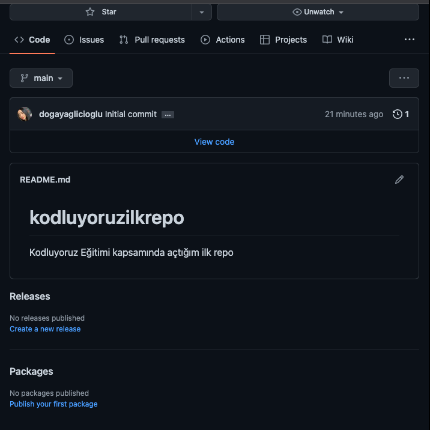

# Kodluyoruz Ilk Repo
www.patika.dev 
Bu repo [Kodluyoruz](https://www.kodluyoruz.org/) Node.js Eğitiminde oluşturduğumuz ilk repo. İçerisinde bir ader README dosyası, bir adet de index.html barındırıyor.


#Installation
Öncelikle projeyi clonelayın. 
````
git clone https://github.com/dogayaglicioglu/kodluyoruzilkrepo.git
``````
# Usage
Projeyi cloneladıktan sonra Visual Studio Code programında açınız.

Linux için:
````
cd kodluyoruzilkrepo
code .
``````
# Contributing
Pull requestler kabul edilir. Büyük değişiklikler için, lütfen önce neyi değiştirmek istediğinizi tartışmak için bir konu açınız.

# License
[MIT](https://choosealicense.com/licenses/mit/)
